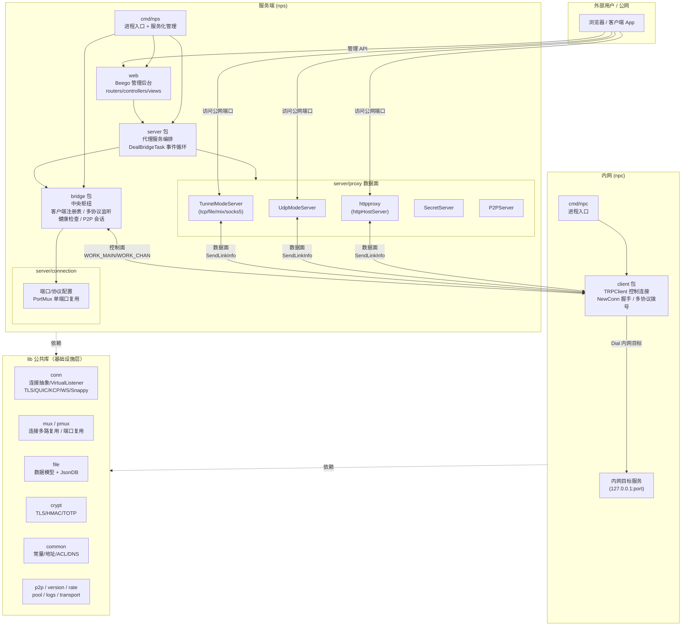
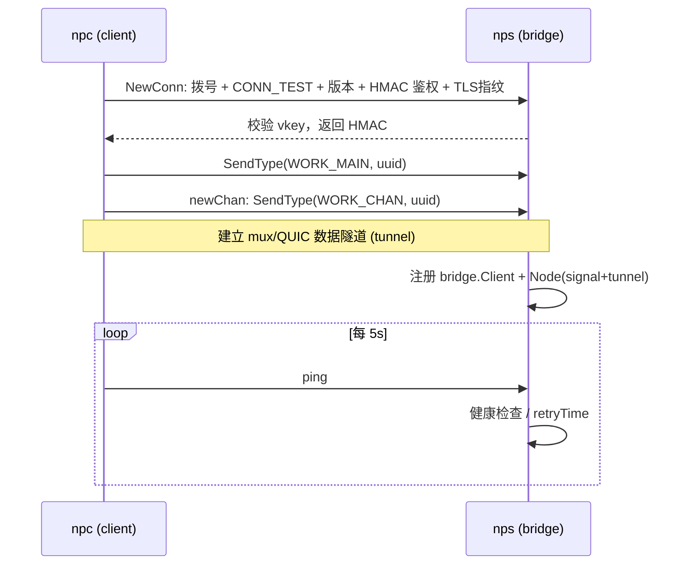

# NPS-Plus 架构分析与二次开发指南

> 基于当前分支 `v0.34.7`（HEAD detached），`module github.com/djylb/nps`，Go 1.26。
> NPS-Plus 是一款支持 TCP/UDP/HTTP(S)/SOCKS5/文件 等穿透模式的内网穿透代理系统，采用 **C/S 架构**：`nps`（服务端）监听公网，管理穿透隧道；`npc`（客户端）部署在内网，把内网服务反向代理到服务端。

## 1. 整体架构图



**核心设计要点**
- **控制面与数据面分离**：`bridge` 维护客户端长连接（signal + tunnel），`server/proxy` 在用户访问公网端口时，通过 `Bridge.SendLinkInfo()` 向客户端"借"一条连接，再与内网目标打通。
- **多路复用**：单条 TCP/QUIC 隧道上用 `mux.Mux` 虚拟出多条逻辑连接，避免每条请求都重新建链。
- **协议嗅探复用端口**：`pmux` 可在同一端口上根据前导字节区分 bridge / http / https / web 流量；bridge 内部还能在 TLS+WSS 共用端口时嗅探 `ClientHello` 与 HTTP 方法分流。

## 2. 目录结构与模块职责

| 目录 | 角色 | 关键文件 | 二次开发关注点 |
|------|------|----------|----------------|
| `cmd/nps` | 服务端进程入口 | `nps.go` | 启动顺序、`run()` 中读取 `nps.conf` 并初始化各开关 |
| `cmd/npc` | 客户端进程入口 | `npc.go` | 命令行参数、-config 文件模式、`StartFromFile` |
| `bridge` | 服务端中央枢纽 | `bridge.go`、`client.go`、`handshake.go`、`health.go`、`listener.go`、`replay.go` | 客户端生命周期、节点路由、协议分流、P2P |
| `server` | 服务端代理编排 | `server.go`、`web.go`、`runtime.go`、`list.go` | `NewMode` 模式分发、`DealBridgeTask` 事件循环 |
| `server/proxy` | 各类穿透服务实现 | `base.go`、`tcp.go`、`udp.go`、`socks5.go`、`secret.go`、`p2p.go`、`httpproxy/` | 新增/修改穿透模式 |
| `server/connection` | 端口与协议配置 | `connection.go` | 监听端口、单端口复用 `pmux` |
| `client` | 客户端实现 | `client.go`、`control.go`、`local.go`、`health.go`、`file.go` | 握手、隧道、P2P、本地服务 |
| `lib/conn` | 连接抽象层 | `conn.go`、`listener.go`、`tls.go`、`quic.go`、`kcp.go`、`websocket.go`、`snappy.go` | 新增传输协议、压缩/加密封装 |
| `lib/mux`、`lib/pmux` | 多路复用 / 端口复用 | `mux.go`、`pmux` | 传输性能与协议识别 |
| `lib/file` | 数据模型 + 持久化 | `obj.go`、`db.go`、`file.go` | 扩展 Client/Host/Tunnel 字段 |
| `lib/crypt` | 加密/证书/2FA | — | TLS、HMAC 校验、TOTP |
| `lib/common` | 公共常量与工具 | `const.go`、`addr.go`、`proxyacl.go`、`dns.go` | 协议标志、ACL、地址解析 |
| `lib/p2p`、`lib/version`、`lib/rate`、`lib/pool`、`lib/logs`、`lib/transport` | 专项能力 | — | P2P 打洞、协议版本协商、限速、对象池、日志 |
| `web` | 管理后台 | `routers/`、`controllers/`、`views/`、`static/` | 后台功能扩展 |

## 3. 核心模块详解

### 3.1 入口层 `cmd/nps` 与 `cmd/npc`
- 两者都基于 `kardianos/service` 实现跨平台服务化（install/start/stop/uninstall），并通过 `pflag` 解析参数（含 `-c conf_path`）。
- **服务端** `run()`（`cmd/nps/nps.go:288`）：加载 `nps.conf` → 初始化 `connection.InitConnectionService()`（端口配置）→ 加载证书 → 根据配置开关启用 KCP/QUIC/TLS/WS/WSS → `server.StartNewServer()` 启动。
- **客户端** `run()`（`cmd/npc/npc.go:366`）：支持命令行直连（`-s/-k/-t`）、配置文件（`-c`）、P2P 模式（`-password`）。核心为 `client.NewRPClient(...).Start(ctx)`，并对每个 server 地址起一个 goroutine，断线按 `auto_reconnect` 自动重连。

### 3.2 `bridge` —— 服务端中枢
`Bridge` 结构体（`bridge/bridge.go`）是整个服务端的"状态中心"：
- `Client *sync.Map`：clientId → `*bridge.Client`；`bridge.Client` 内含 `nodes sync.Map`（多节点，支持主备切换 `SelectMode: Primary/RoundRobin/Random`）。
- 四组 `VirtualListener`（TCP/TLS/WS/WSS）：既可从真实监听器收连接，也可通过 `DialVirtual` 内联调用（用于 `bridge://` 本地调用）。
- `OpenHost/OpenTask/CloseTask/CloseClient/SecretChan`：配置变更与密钥事件通道，`server.DealBridgeTask()` 消费。
- **健康检查** `ping()`：每 5s 检测节点，连续 3 次失败才关闭客户端（`retryTimeMax=3`）。
- **协议分流**：`startBridgeReservedTLSGateway` 在 TLS+WSS 共用端口时，嗅探前 3 字节（`clientHello` vs HTTP 方法）分流到对应虚拟监听器。

客户端侧结构（`bridge/client.go`）：
- `Node`：单条客户端连接（含 `signal *conn.Conn` 控制通道、`tunnel any` 数据通道，`*mux.Mux` 或 `*quic.Conn`）。
- `Client`：聚合多 `Node`，提供 `GetNode()`、`CheckNode()` 实现主备/轮询/随机路由与离线节点清理（带 grace window 保护）。

### 3.3 `server` —— 代理编排
- `StartNewServer`（`server/server.go:142`）：创建 `Bridge` → `Bridge.StartTunnel()` → 启动 P2P Server → `go DealBridgeTask()` → 按 `webServer` 模式启动 Web。
- `NewMode`（`server/server.go:202`）：根据 `Tunnel.Mode` 分发到不同代理服务：
  - `tcp`/`file` → `TunnelModeServer(ProcessTunnel)`
  - `mixProxy`/`socks5`/`httpProxy` → `TunnelModeServer(ProcessMix)`
  - `tcpTrans` → `TunnelModeServer(HandleTrans)`
  - `udp` → `UdpModeServer`
  - `webServer`/`httpHostServer` → `httpproxy.NewHttpProxy`
- `DealBridgeTask`（`server/server.go:89`）：事件循环，处理 `OpenHost`（清缓存）、`OpenTask`/`CloseTask`（启停隧道）、`CloseClient`（清理隧道与 Host）、`SecretChan`（secret 模式连接）。

### 3.4 `server/proxy` —— 数据面实现
- `base.go` 定义 `Service` 接口（`Start`/`Close`）与 `NetBridge` 接口（`SendLinkInfo` 等），`BaseServer` 提供流量统计、鉴权、黑名单、连接数/流量限制。
- `DealClient`（`server/proxy/base.go:105`）是通用转发核心：校验 ACL/黑名单 → 构造 `conn.Link` → `Bridge.SendLinkInfo()` 向客户端借连接 → `conn.CopyWaitGroup` 双向拷贝。
- `tcp.go` 的 `TunnelModeServer` 同时支持真实监听（`Start`）与虚拟注入（`ServeVirtual`/`DialVirtual`），便于 `bridge://` 内联复用。

### 3.5 `client` —— 客户端
- `NewConn`（`client/control.go:316`）：按 `tp`（tcp/tls/ws/wss/quic/kcp）拨号，完成版本协商、HMAC 鉴权、TLS 证书指纹校验（`SkipTLSVerify` 可跳过）。
- `TRPClient.Start`（`client/client.go:61`）：建立控制连接（WORK_MAIN）→ `newChan()` 建立数据隧道（WORK_CHAN，mux 或 QUIC）→ `ping()` 保活 → `handleMain()` 处理服务端下发的 UDP/P2P 指令。
- `handleChan`（`client/client.go:394`）：收到服务端借来的连接后，解析 `Link`，连接内网目标（`net.DialTimeout`）或处理 socks5-udp5 / file 模式，再 `conn.CopyWaitGroup` 转发。

### 3.6 `lib` —— 基础设施
- `conn`：`conn.Conn` 是对 `net.Conn` 的封装，统一了长度前缀读写、`Link` 编解码、ACK、加密/压缩（`GetConn`/`WrapConn`）；`VirtualListener`/`OneConnListener` 提供"虚拟连接"能力；`snappy.go` 提供压缩。
- `mux`：在单条物理连接上多路复用（`mux.NewMux`），是隧道性能关键。
- `file`：`obj.go` 定义 `Client`/`Tunnel`/`Host`/`Target`/`Flow`/`MultiAccount` 等核心数据模型（含 ACL 白/黑名单、目标地址轮询 `GetRandomTarget`）；`db.go` 是 JsonDB 持久化（`GetDb()` 全局单例）。
- `common/const.go`：所有协议标志（`WORK_MAIN`、`WORK_CHAN`、`NEW_TASK`、`CONN_TCP`…）与默认端口。

## 4. 关键数据流

### 4.1 控制连接建立（握手）


### 4.2 一次 TCP 代理请求完整链路
1. 用户访问服务端公网端口 → `TunnelModeServer.handleConn`（`server/proxy/tcp.go`）。
2. `BaseServer.CheckFlowAndConnNum` 校验客户端额度 → `process`（`ProcessTunnel`）取目标地址。
3. `DealClient` 构造 `Link` 并调用 `Bridge.SendLinkInfo(clientId, link, task)`。
4. `bridge` 选节点（`SelectClientRouteUUID`/`GetNode`），通过 `Node.tunnel` 开一条 mux 子连接，下发 `Link` 到客户端。
5. 客户端 `handleChan` 收到 `Link`，`net.Dial` 内网目标，`conn.CopyWaitGroup` 双向转发。
6. 流量经 `FlowAdd` 计入客户端/隧道统计。

### 4.3 多节点路由
`bridge.Client` 支持同一 clientId 注册多个 `Node`（如主备两台内网机器）。`ClientSelectMode`（Primary/RoundRobin/Random，由 `bridge_select_mode` 配置）决定 `GetNode()` 选择策略；离线节点在 grace window 后自动清理，实现高可用切换。

## 5. 客户端与服务端连接详解

一个客户端（npc）启动后，与 nps 服务端之间会建立 **2 条物理连接**（网络层），通过版本握手后分别承担不同角色：

### 5.1 连接全景图

```
npc (客户端)                            nps (服务端 bridge)
════════════════════════════════════════════════════════════

  NewConn() #1
  ┌─────────────── WORK_CHAN ──────────────┐
  │    握手 (CONN_TEST + 版本 + HMAC)       │
  │    SendType("chan", uuid)              │
  │                                        │
  │  ┌─── mux.Mux ───────────────────┐     │
  │  │  s.tunnel (数据隧道)           │     │   ← bridge 端创建 mux.NewMux()
  │  │                               │     │     node.AddTunnel(mux)
  │  │  Accept() ← 服务端"借"连接     │     │
  │  │  ├─ handleChan (TCP代理)      │     │
  │  │  ├─ handleChan (UDP代理)      │     │
  │  │  ├─ handleChan (文件代理)     │     │
  │  │  └─ ...                       │     │
  │  └───────────────────────────────┘     │
  └────────────────────────────────────────┘

  mux.NewConn() (从 tunnel 中拆出)
  ┌─────────────── WORK_MAIN ──────────────┐
  │    SendType("main", uuid)              │   ← mux 虚拟子连接，SetPriority()
  │                                        │
  │  s.signal (控制通道)                    │   ← bridge 端 node.AddSignal(c)
  │  handleMain() 循环读取:                │
  │  ├─ NEW_UDP_CONN → P2P打洞指令         │
  │  └─ ping 保活                          │
  └────────────────────────────────────────┘
```

### 5.2 两条连接详解

| # | 物理连接 | 协议标志 | 传输层角色 | 用途 |
|---|---------|---------|-----------|------|
| **1** | `NewConn()` → `newChan()` | `WORK_CHAN` (`"chan"`) | **数据隧道** (`s.tunnel`) | 承载所有代理流量。服务端通过 `mux.Mux` 在此物理连接上多路复用，每当外部用户访问代理端口时，bridge 就通过 mux 拆出一条子连接，下发 `Link` 信息给客户端，客户端再连接内网目标进行转发 |
| **2** | 从隧道 mux 中 `NewConn()` | `WORK_MAIN` (`"main"`) | **控制通道** (`s.signal`) | 传递控制指令（如 P2P 打洞指令 `NEW_UDP_CONN`）、健康检查上报。客户端在 `handleMain()` 中循环读取服务端下发的指令 |

#### 连接 #1 — 数据隧道

客户端通过 `NewConn()` 建立物理连接后调用 `newChan()`（`client/client.go:324-358`）：
- TCP/KCP 模式下包装成 `mux.NewMux(tunnel.Conn, ...)`，支持多路复用
- QUIC 模式下直接使用 `quic.Conn` 的内置 Stream 复用
- 然后进入 `Accept()` 循环，处理服务端"借"来的每一条子连接

服务端收到 `WORK_CHAN` 后（`bridge/handshake.go:323-389`）：创建对应的 `mux.Mux` → `node.AddTunnel(mux)` → 如果是 v5+ 协议，还会从 tunnel mux 中 `Accept()` 等待 `WORK_MAIN` 连接。

#### 连接 #2 — 控制通道

v5+ 协议中（`client/client.go:87-131`）：
- 从 tunnel mux 中 `t.NewConn()` 拆出子连接
- `mc.SetPriority()` 标记为高优先级，确保控制指令不被数据流量阻塞
- `SendType(c, common.WORK_MAIN, s.uuid)` 声明为控制通道
- 赋值给 `s.signal`，在 `handleMain()` 中循环读取服务端指令

服务端收到 `WORK_MAIN` 后（`bridge/handshake.go:291-321`）：`node.AddSignal(c)` 注册为信号通道，启动 `GetHealthFromClient` 处理健康检查。

v4 及以下版本中，`WORK_MAIN` 是独立物理连接（`client/client.go:65-83`），v5+ 改为从 tunnel mux 中拆出以减少物理连接数。

### 5.3 为什么这样设计？

1. **减少物理连接数**：只有 1 条物理连接承载所有代理流量（通过 mux 多路复用），大幅减少 TCP 握手开销
2. **控制与数据分离**：控制通道走 mux 子连接而非独立物理连接，但通过 `SetPriority()` 确保控制指令优先传输，不被数据流量阻塞
3. **兼容旧协议**：v4 及以下版本中 `WORK_MAIN` 是独立物理连接，v5+ 改为从 tunnel mux 中拆出

### 5.4 补充：其他可选连接

除了上述 2 条核心连接外，某些场景下还会建立额外连接：

| 场景 | 连接类型 | 说明 |
|------|---------|------|
| 配置文件模式 | `WORK_CONFIG` | `StartFromFile` 中先建一条临时连接发送隧道/主机配置，完成后关闭，再建正式连接 |
| P2P 模式 | `WORK_P2P` | P2P 打洞时，访问者额外建一条连接用于协调 NAT 穿透 |
| Secret 模式 | `WORK_SECRET` | 密钥模式下的额外连接 |

### 5.5 mux 优先级机制

mux 内部的 `priorityQueue` 支持三级优先级，按 `highest → middle → lowest` 顺序出队：

| 级别 | 内容 | 说明 |
|------|------|------|
| `highest` | ping 心跳包 | 硬编码，保证链路存活检测 |
| `middle` | 新建连接包 + `WORK_MAIN` 控制通道 + `SetPriority()` 标记的数据 | 控制指令优先于业务数据 |
| `lowest` | 普通数据包 | 默认所有业务数据 |

`Conn.SetPriority()` 是一个 `bool` 开关（`lib/mux/conn.go:44-48`），调用后该 mux 子连接的所有数据包进入 `middleChain`。目前只有 `WORK_MAIN` 控制通道和 bridge 握手连接被标记了优先级，普通代理数据通道没有。`starving` 计数器防止低优先级完全饿死。

### 5.6 协议版本差异：v4 vs v5+

#### 版本定义

版本号定义在 `lib/version/version.go`，通过索引映射：

```go
const VERSION = "0.34.7"

var MinVersions = []string{
    "0.26.0", // 0
    "0.27.0", // 1
    "0.28.0", // 2
    "0.29.0", // 3
    "0.30.0", // 4  ← v4
    "0.31.0", // 5  ← v5
    "0.32.0", // 6
    "0.33.0", // 7
    "0.34.0", // 8
}
```

客户端 `Ver` 默认为 `version.GetLatestIndex()`（当前为 8），可通过 `-ver` 命令行参数降级。

#### 核心差异：连接复用模型

v4 到 v5 最根本的变化是**连接复用模型**：

```
v4 (0.30.0):                           v5+ (0.31.0+):
══════════════                          ═══════════════
  物理连接1 ── WORK_MAIN (signal)          物理连接 ── mux ─┬── WORK_CHAN (tunnel)
  物理连接2 ── WORK_CHAN (tunnel)                          ├── WORK_MAIN (signal, 子连接)
                                                           └── 代理子连接1,2,3...
```

#### 逐差异点详解

| # | 差异点 | 文件:行号 | 判断条件 | v4 行为 | v5+ 行为 |
|---|--------|-----------|----------|---------|----------|
| **1** | signal 建立方式 | `client/client.go:65-131` | `Ver < 5` / `Ver > 4` | `NewConn()` 建立独立物理连接作为 signal | 从 tunnel mux 中 `NewConn()` / `OpenStreamSync()` 拆出子连接，`SetPriority()` |
| **2** | QUIC tunnel 类型 | `client/client.go:348-358` | `Ver > 4 && QUIC` | tunnel 始终是 `mux.NewMux(...)` | QUIC 时 tunnel 直接是 `*quic.Conn`（利用原生 Stream 复用） |
| **3** | 服务端 tunnel 类型 | `bridge/handshake.go:329-335` | `ver > 4` | WORK_CHAN tunnel 始终包装为 Mux | QUIC 时直接使用 QUIC session |
| **4** | 服务端子连接 Accept | `bridge/handshake.go:357-388` | `ver > 4` | 不 Accept tunnel 子连接 | 启动 goroutine 持续 `Accept()` tunnel 中的子连接，交给 `typeDeal` 处理（WORK_MAIN 通过此路径到达） |
| **5** | UUID 生成 | `bridge/handshake.go:262-286` | `ver < 5` | 仅用 IP 生成 UUID（同 IP 多客户端会冲突） | 用 IP:Port 生成 UUID（可区分同 IP 不同客户端） |
| **6** | UUID 显式交换 | `client/control.go:602-610`<br>`bridge/handshake.go:220-227` | `ver > 5` | 不发送/接收 UUID | v6+ 客户端显式发送 UUID，服务端下发自身 UUID |
| **7** | 节点离线判定 | `bridge/client.go:227-230` | `BaseVer < 5` | `tunnel关闭 && signal关闭` 才算离线 | 统一为 `!isOnline()`（tunnel 或 signal 任一关闭即离线） |
| **8** | 重复节点处理 | `bridge/client.go:300-304` | `BaseVer < 6` | 已有在线节点时直接关闭新节点 | v6+ 调用 `existing.AddNode(n)` 合并节点 |
| **9** | ACK 机制 | `bridge/link.go:179` | `BaseVer > 5` | 不读 ACK | v6+ 支持 `NeedAck` 选项时读取客户端 ACK |
| **10** | Secret/Visitor | `client/local.go:408-448` | `Ver > 5` | secret 连接直接使用原始 conn | v6+ 引入 `WORK_VISITOR` 类型，复用 tunnel 子连接 |
| **11** | UDP 分帧 | `client/client.go:459` | `Ver > 6` | UDP 无帧协议 | v7+ UDP 启用帧协议（`isFramed=true`） |

#### 关键代码对比

**差异点 1 — signal 建立（最核心变化）：**

v4 路径（`client/client.go:65-83`）：
```go
if Ver < 5 {
    c, uuid, err := NewConn(...)      // 独立物理连接
    SendType(c, common.WORK_MAIN, ...)
    s.signal = c
}
s.newChan()                            // 再建 WORK_CHAN
```

v5 路径（`client/client.go:85-131`）：
```go
s.newChan()                            // 先建 WORK_CHAN（物理连接 + mux）
if Ver > 4 {
    switch t := s.tunnel.(type) {
    case *mux.Mux:
        mc, _ := t.NewConn()           // 从 mux 拆子连接
        mc.SetPriority()               // 标记高优先级
        SendType(conn.NewConn(mc), common.WORK_MAIN, ...)
        s.signal = c
    case *quic.Conn:
        stream, _ := t.OpenStreamSync(...)  // 从 QUIC session 开流
        SendType(conn.NewConn(sc), common.WORK_MAIN, ...)
        s.signal = c
    }
}
```

**差异点 4 — 服务端 Accept 子连接（v5+ 关键路径）：**

```go
// bridge/handshake.go:357-388
if ver > 4 {
    go func() {
        switch t := anyConn.(type) {
        case *mux.Mux:
            conn.Accept(t, func(c net.Conn) {
                mc, _ := c.(*mux.Conn)
                mc.SetPriority()
                go s.typeDeal(conn.NewConn(c), id, ver, vs, tunnelType, false)
            })
        case *quic.Conn:
            for {
                stream, _ := t.AcceptStream(...)
                go s.typeDeal(conn.NewConn(sc), id, ver, vs, tunnelType, false)
            }
        }
    }()
}
```

这个 Accept 循环正是 v5+ 中 `WORK_MAIN` 到达服务端的路径——客户端从 tunnel 拆出子连接发送 `WORK_MAIN`，服务端 Accept 到后通过 `typeDeal` 路由到 `case common.WORK_MAIN` 分支。

---

## 6. 配置体系
- 服务端：`conf/nps.conf`（beego ini 格式），关键项：`bridge_port`/`bridge_tcp_port`/`bridge_tls_port`/`bridge_ws_port`/`bridge_wss_port`/`bridge_path`、`bridge_type`(tcp/kcp/quic/udp/both)、`web_port`、`http_proxy_port`/`https_proxy_port`、`p2p_port`、`kcp_enable`/`quic_enable`、`bridge_select_mode`、`public_vkey`、`allow_local_proxy` 等。
- 客户端：命令行或 `conf/npc.conf`（`lib/config`），支持多 server/多 vkey 逗号分隔。
- 端口复用：当 `bridge_port` 与 `web_port`/`http_proxy_port` 等相同时，自动启用 `pmux` 单端口多协议复用（`server/connection/connection.go:84`）。

## 7. 二次开发指引

### A. 新增一种穿透模式
1. 在 `lib/file/obj.go` 的 `Tunnel` 增加模式字段（如需）。
2. 在 `server/server.go: NewMode` 增加 `case "yourMode"` 分发到新的 `proxy.Service` 实现（参考 `TunnelModeServer`）。
3. 在 `server/proxy/base.go` 的 `Service` 接口约束下实现 `Start`/`Close`，复用 `DealClient` 借连接。
4. 在 Web 后台 `web/controllers` 与 `web/views` 增加对应配置入口。

### B. 新增传输协议（如新隧道类型）
- 在 `lib/conn` 增加连接封装（参考 `quic.go`/`kcp.go`），在 `client/control.go: NewConn` 的 `switch tp` 增加分支，并在 `bridge/bridge.go` 的监听器启动与 `common/const.go` 增加常量。

### C. 扩展数据模型 / 持久化
- 修改 `lib/file/obj.go` 的结构体（注意 `sync.RWMutex` 嵌入与 `json` 标签）；`db.go` 的 JsonDB 会自动持久化新增字段。

### D. 客户端能力扩展
- 在 `client/client.go` 的 `handleChan` 增加新的 `ConnType` 处理分支；同步在服务端 `conn.Link` 与 `common/const.go` 约定新类型。

### E. 调试与可观测
- `pprof`：服务端 `pprof_port`、客户端 `-pprof` 可开启性能分析。
- 日志：`logs` 包支持 stdout/file/both，级别 trace~panic，可输出到 `docker`。

## 8. 关键文件速查（带行号）

### 7.1 服务端入口
```go
// cmd/nps/nps.go:288-325
func run() {
	routers.Init()
	task := &file.Tunnel{Mode: "webServer"}
	// ... 读取配置、初始化连接服务、证书、各协议开关 ...
	go server.StartNewServer(task, timeout)
}
```

### 7.2 服务端启动编排
```go
// server/server.go:142-173
func StartNewServer(cnf *file.Tunnel, bridgeDisconnect int) {
	Bridge = bridge.NewTunnel(...)
	go func() { _ = Bridge.StartTunnel() }()
	// 启动 P2P、DealBridgeTask、流量统计、Web
}
```

### 7.3 代理模式分发
```go
// server/server.go:202-236
func NewMode(Bridge *bridge.Bridge, c *file.Tunnel) proxy.Service {
	// 按 Mode 分发到不同 proxy.Service
}
```

### 7.4 客户端启动
```go
// client/client.go:61-142
func (s *TRPClient) Start(ctx context.Context) {
	// 建立控制连接 + 数据隧道 + ping + handleMain
}
```

### 7.5 客户端握手
```go
// client/control.go:316-592
func NewConn(tp string, vkey string, server string, proxyUrl string, localIP string) (*conn.Conn, string, error) {
	// 多协议拨号 + 版本协商 + HMAC 鉴权
}
```
